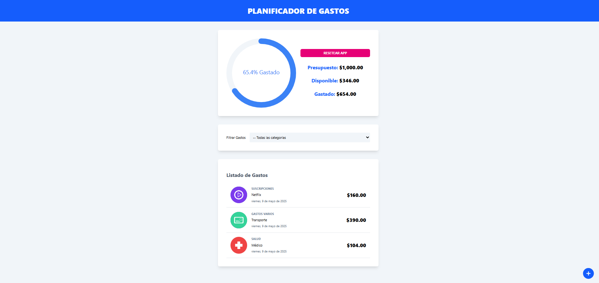

# 📊 Control de Gastos

[Live Demo](https://expenses-control-da2025.netlify.app/)

Control de Gastos es una aplicación de gestión financiera que permite a los usuarios definir un presupuesto, añadir gastos categorizados por nombre y valor, y llevar un control eficiente de los gastos. La aplicación muestra el presupuesto total, el dinero disponible y el guardado. Además, un gráfico circular dinámico representa visualmente el porcentaje gastado.

### ⚙️ Funcionalidades

| Funcionalidad                                           | Descripción                                                                                           |
|---------------------------------------------------------|-------------------------------------------------------------------------------------------------------|
| ✅ Definir un presupuesto.                              | Establecer un presupuesto inicial para el seguimiento de gastos.                                        |
| ✅ Añadir gastos por categoría, nombre y monto.           | Registrar cada gasto y categorizarlo para una mejor gestión.                                            |
| ✅ Representación visual del porcentaje gastado.          | Utiliza un gráfico circular dinámico para mostrar cuánto del presupuesto ha sido utilizado.              |
| ✅ Editar o eliminar gastos con gestos de deslizamiento. | Deslizar a la derecha para actualizar y a la izquierda para eliminar un registro.                        |
| ✅ Cálculo del presupuesto en tiempo real.                | Muestra el dinero disponible, gastado y guardado a medida que se actualizan los gastos.                  |
| ✅ Validación de datos para un funcionamiento confiable. | Garantiza entradas correctas y una gestión precisa del presupuesto.                                      |

### 🛠️ Tecnologías Utilizadas

- React
- TypeScript
- Tailwind CSS
- useReducer
- useState
- useMemo
- Context API
- Librería de gráficos para el gráfico circular dinámico
- Librería de gestos para acciones de deslizamiento

### 📸 Vista previa

### 💻 Instalación

1. Clona el repositorio.
2. Ejecuta `npm install` para instalar las dependencias.
3. Ejecuta `npm start` para iniciar el servidor de desarrollo.

### 🔗 Live Demo

Mira la demo en vivo: [Control de Gastos](https://expenses-control-da2025.netlify.app/)

---

Si necesitas algún ajuste o sugerencia adicional, ¡déjamelo saber!

# 📊 Control de Gastos

[Live Demo](https://expenses-control-da2025.netlify.app/)

Control de Gastos is a financial management application that allows users to set a budget, add expenses categorized by name and value, and track spending efficiently. The app displays the total budget, available money, and saved amount. Additionally, a dynamic pie chart visually represents the spent percentage.

### ⚙️ Features

| Feature                                                   | Description                                                                                           |
|-----------------------------------------------------------|-------------------------------------------------------------------------------------------------------|
| ✅ Define a budget.                                        | Set an initial budget for expense tracking.                                                            |
| ✅ Add expenses by category, name, and amount.             | Record every expense and categorize it for better management.                                           |
| ✅ Visual representation of spent percentage.              | Uses a dynamic pie chart to show how much of the budget has been used.                                   |
| ✅ Edit or delete expenses with swipe gestures.            | Swipe right to update and left to remove an entry.                                                      |
| ✅ Real-time budget calculation.                           | Displays available, spent, and saved amounts as you update expenses.                                     |
| ✅ Data validation for reliable functionality.             | Ensures correct inputs and budget management.                                                           |

### 🛠️ Technologies Used

- React
- TypeScript
- Tailwind CSS
- useReducer
- useState
- useMemo
- Context API
- Chart library for dynamic pie chart
- Gesture library for swipe actions

### 📸 Preview

### 💻 Installation

1. Clone the repository.
2. Run `npm install` to install dependencies.
3. Run `npm start` to start the development server.

### 🔗 Live Demo

Check out the live demo: [Expenses Control](https://expenses-control-da2025.netlify.app/)

---

Feel free to customize the content or let me know if you need any changes!

